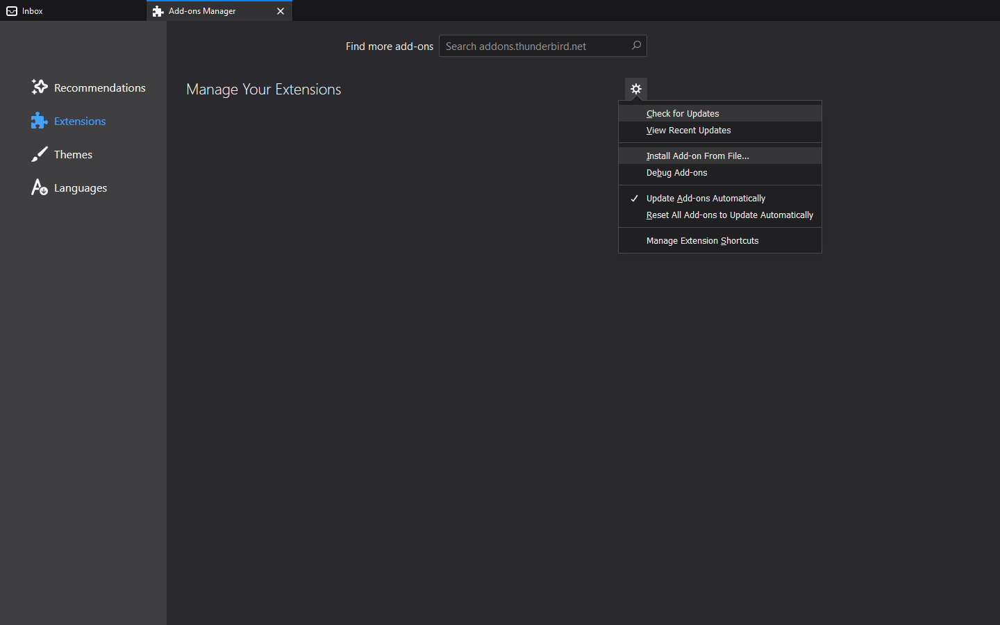
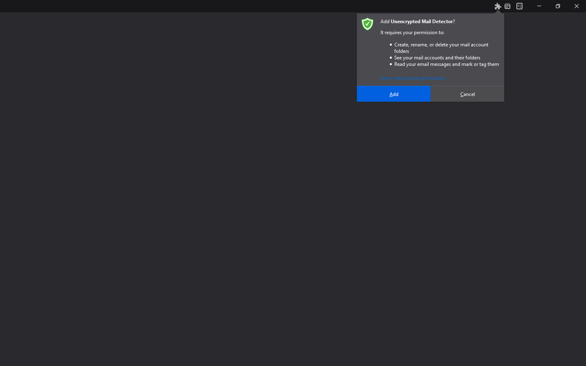
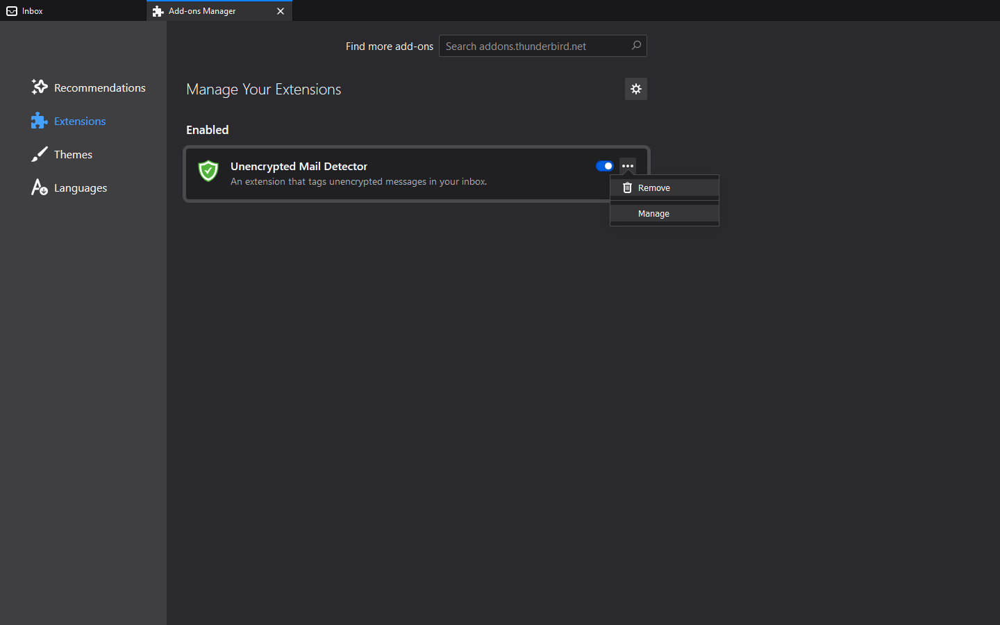
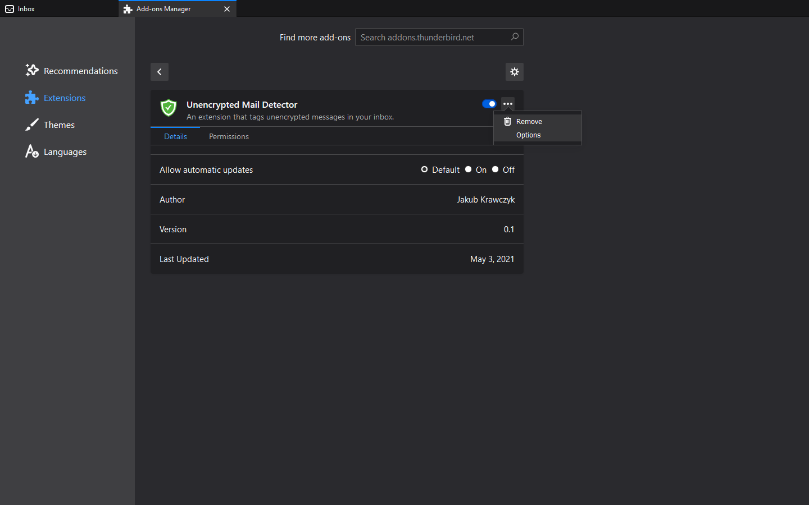
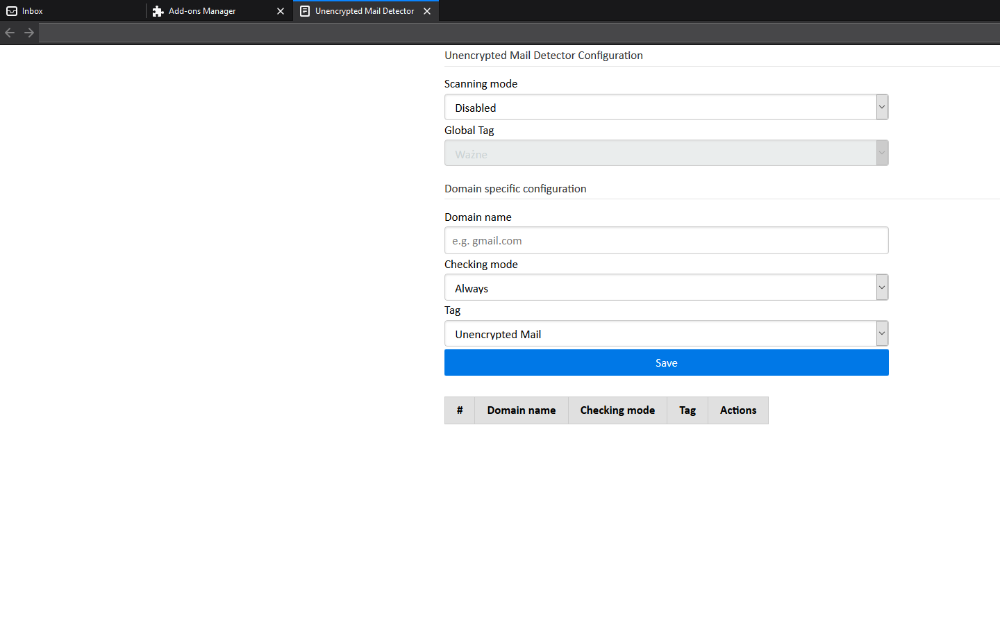
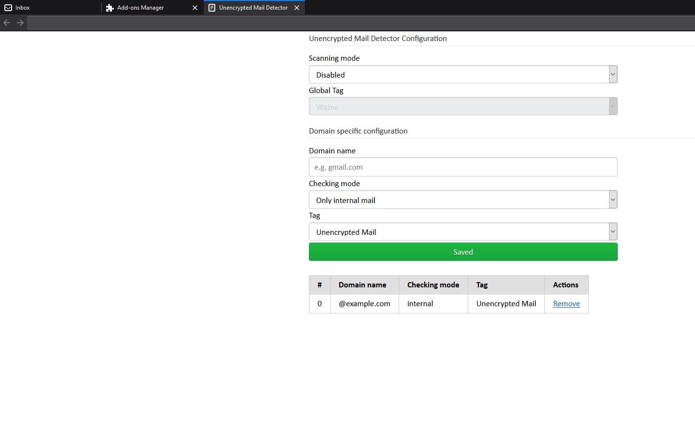

Unencrypted Mail Detector (UMD)
===============================

### How to install:

1. Download the latest release:
```
https://github.com/jakubkrawczyk/unencrypted-mail-detector/releases
```

2. Install it from the Add-ons Manager:


3. Presented permissions are required in order for the add-on to be able to read incoming messages and tag them:


4. Congratulations! Now you can configure the add-on:



5. The add-on is disabled after installation. You can configure it to either scan all incoming e-mails or add custom rules:


6. Add your custom rule and click 'Save' or ENTER in the domain name field:


7. You're all set!
